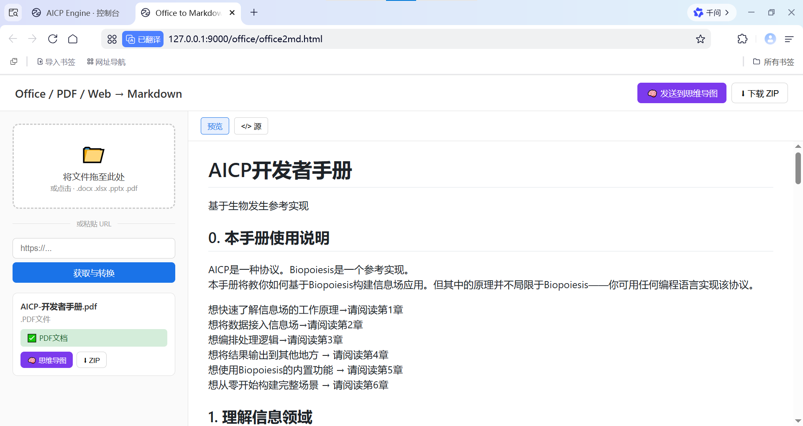
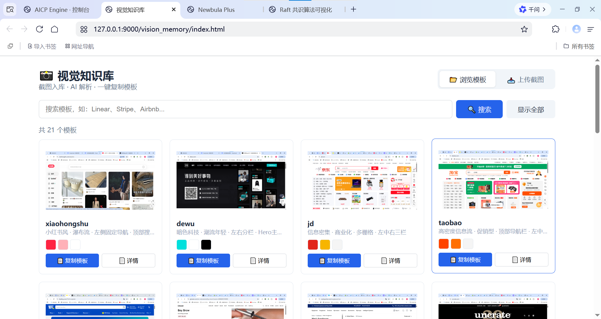
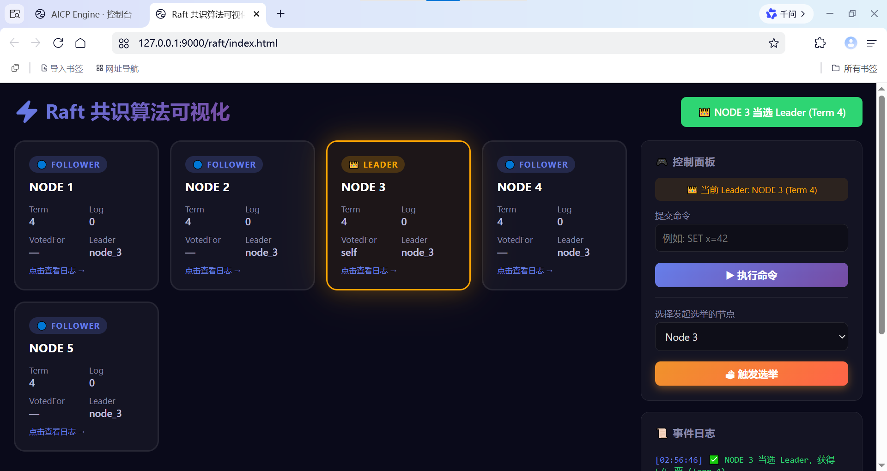
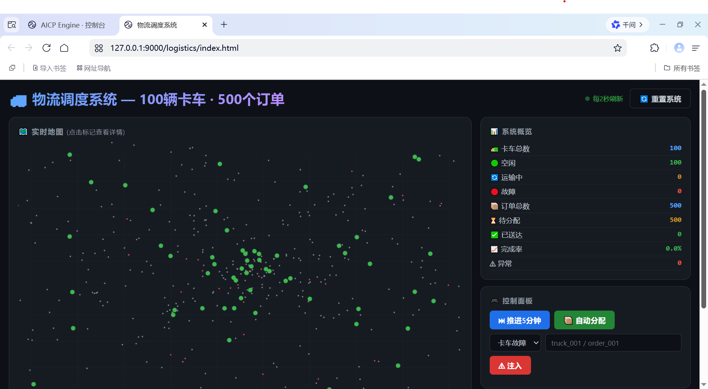

# AICP Engine
[English](README.md) | [中文文档](README_CN.md)
> AI self-growing OS engine powered by the AICP protocol. An AI productivity platform.
> Based on [Agent Interaction & Communication Protocol](https://github.com/woozheng/aicp)
> No frameworks. No tools to download. Nothing to configure or schedule. AI self-orchestrates, self-composes, self-generates.
> Cloud-deployable. Remotely accessible.
> Humans define the protocol and the requirements. AI does the growing. AICP Engine doesn't produce plugins — it solves problems.
> Humans verify results. It's not about fancy orchestration, complex workflows, or bloated frameworks.
> A new paradigm for AI AGI. Trust AI. Define rules. The rest follows naturally.

**AICP Engine is not just a platform for building applications — it is also a platform for building AI Agents.**
---

## Core Features

### Three Levels of Execution

1. **Swiss Army Knife** — [AICP CLI](https://github.com/woozheng/aicp_cli), built into the engine. No server needed. One sentence, one result.
2. **Assault Rifle** — The main console. Conversational AI with memory, task management, scheduling, and multi-channel support (Email / Feishu / WeChat).
3. **Howitzer** — AICP Studio. A protocol-driven AI application platform. AI generates and deploys any web application, website, or tool you can imagine.


Built-in Vision Agent — visual auto-recognition with intent-based autonomous operation (Windows desktop).
Built-in [aicp-eat](https://github.com/woozheng/aicp-eat)  Consume everything: Python libraries, cloaude/hermers plugins, CLI exposed as HTTP APIs. AI can curl anything. 

All agents and Studio development tools listed above are created on-demand by AI, driven by the AICP protocol based on human requirements.

**The core characteristic of this platform is not its powerful agents, but the limits of human imagination. This is a protocol engine where AI bootstraps itself.**


### Studio Showcase

#### 1. Any Document / Web Page → Markdown
5 min discussion, 30 sec AI generation, 5 min debugging, 0 bugs.



#### 2. AI Web Design Visual Knowledge Base
Analyzes popular web design patterns, outputs template JSON. Studio can replicate any design. 5 min requirements, 30 sec generation, 3 min debugging, 0 bugs.



#### 3. Raft Consensus Algorithm Visualization
1 min requirements, 30 sec generation, first attempt, 0 bugs.



#### 4. Logistics Dispatch Simulation
100 trucks, 500 orders, full status assignment, real-time location reporting. 3 min requirements, 30 sec generation, first attempt, 0 bugs.



**All projects generated by AICP Studio. AI handles all coding and deployment. Humans only define requirements and verify results.**

---

## Quick Start

### Windows (Desktop Edition with GUI)

```bash
git clone https://github.com/woozheng/aicp_engine.git
cd aicp-engine
pip install -r requirements.txt
copy aicp.yaml.example(En) aicp.yaml  # Add your API Key
python -m runtime
```

System tray appears. Right-click to open applications (all generated by Studio).

Built-in desktop apps:

- **MK Assistant**: Auto text selection, middle-click magic mouse for visual recognition and automation.
- **Newbula LLM Engine**: Converts web AI pages into OpenAI-compatible LLM providers.
- **Office MD Suite**: Convert messy text, project analysis, any Office document to Markdown. Mind maps included.
- **Studio**: Windows desktop + web edition for AI-powered development.

### Docker (Server / macOS / Linux)
从 [Releases](https://github.com/woozheng/aicp_engine/releases) 下载 `aicp-server.tar`,然后

```bash
docker load -i aicp-server.tar
docker run --rm -v $(pwd):/out aicp-server cp /app/aicp.yaml.example /out/aicp.yaml
vim aicp.yaml  # Add your API Key
docker run -d -p 9000:9000 -p 9001:9001 -p 9002:9002 -v $(pwd)/aicp.yaml:/app/aicp.yaml --name aicp-server aicp-server
```

Open http://127.0.0.1:9000 in your browser. All web applications included (desktop apps excluded).

### Studio Workflow

1. Create a project
2. Send the protocol to any web AI (DeepSeek, Qwen, Doubao, Kimi — reads protocol, generates code, no API tokens burned)
3. Confirm requirements
4. AI generates → auto-saves (Windows desktop) / Bookmarklet save (Mac/Linux) → auto-deploys
5. Preview results
6. Request fixes, iterate until done

Don't worry about the code. Code is just a byproduct of application generation, like compiled binaries. Who cares about them? Humans only care about results.


## Ecosystem

 [AICP web](https://github.com/woozheng/aicp)

| Project | Description |
|---------|-------------|
| aicp-cli | Minimal CLI runtime, 2000 lines, stateless direct execution |
| aicp-shell | 7-platform hardware container, HTML controls camera/bluetooth/local filesystem in anywhere |
| aicp-eat | Consume Python/Go/Rust libraries as HTTP APIs |
| aicp-review-bot | AI-powered GitHub PR reviewer |

## Protocol

AICP Protocol v5.3 — 80-line kernel. An agent communication protocol implementable in any language.

Envelop carries everything. Plugin processes everything. Agent injects everything. The engine only routes. Everything else is natural language.

## License

[MIT](LICENSE)

## Contributing

Submit new applications, channels, or Agent roles via Issue / PR. Any function matching `async def execute(envelop, agent)` can register to `core.plugins` as a routing target.

Protocol is the nervous system — make every Agent, tool, and channel a node on the protocol network.


